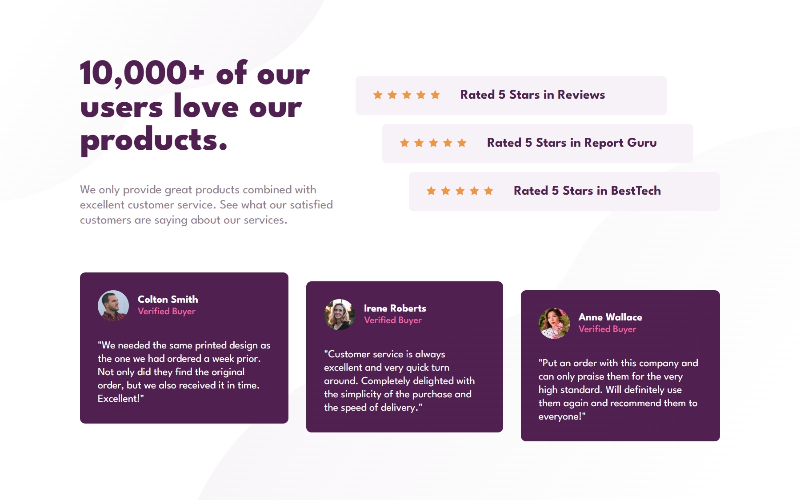

# Frontend Mentor - Social proof section solution

This is a solution to the [Social proof section challenge on Frontend Mentor](https://www.frontendmentor.io/challenges/social-proof-section-6e0qTv_bA). Frontend Mentor challenges help you improve your coding skills by building realistic projects. 

## Table of contents

- [Overview](#overview)
  - [The challenge](#the-challenge)
  - [Screenshot](#screenshot)
- [My process](#my-process)
  - [Built with](#built-with)
- [Author](#author)

**Note: Delete this note and update the table of contents based on what sections you keep.**

## Overview
This challange has a great design and it's very good if you want to work with CSS Grid and nth-child.

### The challenge

Users should be able to:

- View the optimal layout for the section depending on their device's screen size

### Screenshot

## My process
- HTML structure
- CSS style for desktop
- CSS style for mobile

### Built with

- Semantic HTML5 markup
- CSS custom properties
- Flexbox
- CSS Grid

## Author

- Website - [Angel Henriquez](https://github.com/pr0g4ng3l)
- Frontend Mentor - [@pr0g4ng3l](https://www.frontendmentor.io/profile/pr0g4ng3l)
- Twitter - [@navimmii](https://twitter.com/navimmii)
- Linkedin - [Angel Ivan Henriquez Martinez](https://www.linkedin.com/in/angel-ivan-henr%C3%ADquez-mart%C3%ADnez-16a6b6218/)
